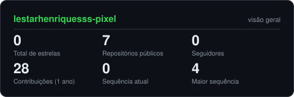
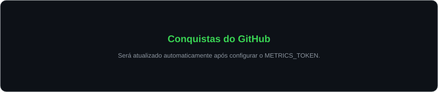
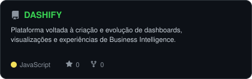
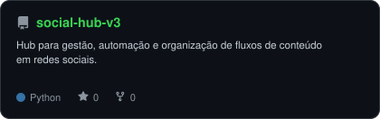
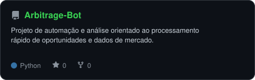
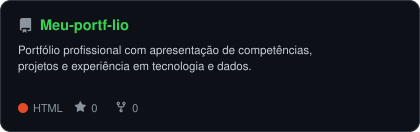

<div align="center">

<!-- Retrato gerado a partir de assets/profile.jpg -->


<br>

<!-- NOME / APRESENTAÇÃO ANIMADA -->
<a href="https://github.com/lestarhenriquesss-pixel">
  
</a>

<br>

<!-- REDES E CONTATO -->
<a href="https://www.linkedin.com/in/lestarangelo"></a>
<a href="mailto:Lestarherminio@gmail.com"></a>
<a href="https://meu-portf-lio-steel.vercel.app/"></a>


</div>

---

## `~/` quem sou eu

```console
$ cat sobre-mim.txt
```

Sou **Lestar Henriques**, profissional de dados com foco em transformar informação em produtos analíticos claros, confiáveis e úteis para tomada de decisão.

- Desenvolvimento de **dashboards, indicadores e análises de performance**
- Construção e evolução de processos de **ETL / ELT, modelagem e qualidade de dados**
- Atuação com **Business Intelligence, Data Analytics, Data Visualization e KPI Management**
- Automação de processos e documentação com foco em **governança da informação**
- Portfólio: **[meu-portf-lio-steel.vercel.app](https://meu-portf-lio-steel.vercel.app/)**
- GitHub: **[@lestarhenriquesss-pixel](https://github.com/lestarhenriquesss-pixel)**

<br>

<div align="center">

## `~/` ferramentas e tecnologias


<br><br>


</div>

---

<div align="center">

## `~/` competências

`Desenvolvimento de Dashboards` · `Data Analytics` · `Business Intelligence` · `Data Visualization` · `KPI Management`  
`Modelagem de Dados` · `ETL / ELT` · `Data Governance` · `Data Quality` · `Governança da Informação`  
`Automação de Processos` · `Performance Analysis` · `Documentação de Processos` · `Google Sheets Avançado` · `Excel Avançado`

</div>

---

<div align="center">

## `~/` radar técnico

<table>
<tr>
<td width="50%" align="center" valign="middle">

<!-- Radar configurável em assets/skills.json -->
<picture>
  <source media="(prefers-color-scheme: dark)" srcset="assets/radar-dark.svg">
  <source media="(prefers-color-scheme: light)" srcset="assets/radar-light.svg">
  
</picture>

</td>
<td width="50%" align="center" valign="middle">

<!-- Radar de linguagens calculado automaticamente pelos repositórios públicos -->
<picture>
  <source media="(prefers-color-scheme: dark)" srcset="assets/radar-langs-dark.svg">
  <source media="(prefers-color-scheme: light)" srcset="assets/radar-langs-light.svg">
  
</picture>

</td>
</tr>
</table>

</div>

---

<div align="center">

## `~/` calendário de contribuições


<br><br>

<picture>
  <source media="(prefers-color-scheme: dark)" srcset="https://raw.githubusercontent.com/lestarhenriquesss-pixel/lestarhenriquesss-pixel/output/snake-dark.svg">
  <source media="(prefers-color-scheme: light)" srcset="https://raw.githubusercontent.com/lestarhenriquesss-pixel/lestarhenriquesss-pixel/output/snake.svg">
  
</picture>

</div>

---

<div align="center">

## `~/` números do GitHub

<picture>
  <source media="(prefers-color-scheme: dark)" srcset="assets/card-stats-dark.svg">
  <source media="(prefers-color-scheme: light)" srcset="assets/card-stats-light.svg">
  
</picture>

<br>


<br><br>



</div>

---

<div align="center">

## `~/` projetos em destaque

<table>
<tr>
<td width="50%">
  <a href="https://github.com/lestarhenriquesss-pixel/DASHIFY">
    <picture>
      <source media="(prefers-color-scheme: dark)" srcset="assets/card-DASHIFY-dark.svg">
      <source media="(prefers-color-scheme: light)" srcset="assets/card-DASHIFY-light.svg">
      
    </picture>
  </a>
</td>
<td width="50%">
  <a href="https://github.com/lestarhenriquesss-pixel/social-hub-v3">
    <picture>
      <source media="(prefers-color-scheme: dark)" srcset="assets/card-social-hub-v3-dark.svg">
      <source media="(prefers-color-scheme: light)" srcset="assets/card-social-hub-v3-light.svg">
      
    </picture>
  </a>
</td>
</tr>
<tr>
<td width="50%">
  <a href="https://github.com/lestarhenriquesss-pixel/Arbitrage-Bot">
    <picture>
      <source media="(prefers-color-scheme: dark)" srcset="assets/card-Arbitrage-Bot-dark.svg">
      <source media="(prefers-color-scheme: light)" srcset="assets/card-Arbitrage-Bot-light.svg">
      
    </picture>
  </a>
</td>
<td width="50%">
  <a href="https://github.com/lestarhenriquesss-pixel/Meu-portf-lio">
    <picture>
      <source media="(prefers-color-scheme: dark)" srcset="assets/card-Meu-portf-lio-dark.svg">
      <source media="(prefers-color-scheme: light)" srcset="assets/card-Meu-portf-lio-light.svg">
      
    </picture>
  </a>
</td>
</tr>
</table>

<sub>

| projeto | foco |
|---|---|
| **[DASHIFY](https://github.com/lestarhenriquesss-pixel/DASHIFY)** | dashboards, BI e produtos analíticos |
| **[social-hub-v3](https://github.com/lestarhenriquesss-pixel/social-hub-v3)** | automação e gestão de conteúdo social |
| **[Arbitrage-Bot](https://github.com/lestarhenriquesss-pixel/Arbitrage-Bot)** | automação, análise e processamento de dados |
| **[Meu-portf-lio](https://github.com/lestarhenriquesss-pixel/Meu-portf-lio)** | portfólio profissional e projetos |

</sub>

</div>

---

<div align="center">

<sub>`dados → contexto → decisão → resultado`</sub>

</div>
