<picture>
  <source media="(max-width: 640px) and (prefers-reduced-motion: reduce)" srcset="assets/profile/hero-mobile-static.svg">
  <source media="(prefers-reduced-motion: reduce)" srcset="assets/profile/hero-static.svg">
  <source media="(max-width: 640px)" srcset="assets/profile/hero-mobile.svg">
  
</picture>

  

  
  
  

Conecto **dados, análise e desenvolvimento** para transformar informação em soluções úteis para a operação e a tomada de decisão. Minha atuação reúne **ETL/ELT, modelagem e qualidade de dados**, **dashboards e indicadores de performance** e **automação de processos**.

<picture>
  <source media="(max-width: 640px) and (prefers-color-scheme: dark) and (prefers-reduced-motion: reduce)" srcset="assets/profile/terminal-mobile-dark-static.svg">
  <source media="(max-width: 640px) and (prefers-color-scheme: light) and (prefers-reduced-motion: reduce)" srcset="assets/profile/terminal-mobile-light-static.svg">
  <source media="(prefers-color-scheme: light) and (prefers-reduced-motion: reduce)" srcset="assets/profile/terminal-light-static.svg">
  <source media="(prefers-reduced-motion: reduce)" srcset="assets/profile/terminal-dark-static.svg">
  <source media="(max-width: 640px) and (prefers-color-scheme: dark)" srcset="assets/profile/terminal-mobile-dark.svg">
  <source media="(max-width: 640px) and (prefers-color-scheme: light)" srcset="assets/profile/terminal-mobile-light.svg">
  <source media="(prefers-color-scheme: light)" srcset="assets/profile/terminal-light.svg">
  
</picture>

<h2><code>~/</code> Ferramentas &amp; tecnologias</h2>

Da integração das fontes à experiência de quem utiliza a informação.

<picture>
  <source media="(max-width: 640px) and (prefers-color-scheme: dark) and (prefers-reduced-motion: reduce)" srcset="assets/profile/stack-mobile-dark-static.svg">
  <source media="(max-width: 640px) and (prefers-color-scheme: light) and (prefers-reduced-motion: reduce)" srcset="assets/profile/stack-mobile-light-static.svg">
  <source media="(prefers-color-scheme: light) and (prefers-reduced-motion: reduce)" srcset="assets/profile/stack-light-static.svg">
  <source media="(prefers-reduced-motion: reduce)" srcset="assets/profile/stack-dark-static.svg">
  <source media="(max-width: 640px) and (prefers-color-scheme: dark)" srcset="assets/profile/stack-mobile-dark.svg">
  <source media="(max-width: 640px) and (prefers-color-scheme: light)" srcset="assets/profile/stack-mobile-light.svg">
  <source media="(prefers-color-scheme: light)" srcset="assets/profile/stack-light.svg">
  
</picture>

**Também no meu repertório:** Google Sheets, Salesforce, BigQuery, documentação de processos e governança da informação.

<h2><code>~/</code> Radar técnico</h2>

<picture>
  <source media="(max-width: 640px) and (prefers-color-scheme: dark) and (prefers-reduced-motion: reduce)" srcset="assets/profile/radars-mobile-dark-static.svg">
  <source media="(max-width: 640px) and (prefers-color-scheme: light) and (prefers-reduced-motion: reduce)" srcset="assets/profile/radars-mobile-light-static.svg">
  <source media="(prefers-color-scheme: light) and (prefers-reduced-motion: reduce)" srcset="assets/profile/radars-light-static.svg">
  <source media="(prefers-reduced-motion: reduce)" srcset="assets/profile/radars-dark-static.svg">
  <source media="(max-width: 640px) and (prefers-color-scheme: dark)" srcset="assets/profile/radars-mobile-dark.svg">
  <source media="(max-width: 640px) and (prefers-color-scheme: light)" srcset="assets/profile/radars-mobile-light.svg">
  <source media="(prefers-color-scheme: light)" srcset="assets/profile/radars-light.svg">
  
</picture>

<b>Como interpretar os radares</b>

**Mapa de atuação:** representa ênfase declarada em BI, SQL, ETL/ELT, qualidade de dados e desenvolvimento. Não é uma avaliação certificada de proficiência.

**Linguagens no código:** índice relativo, não percentual. A fórmula é `100 × (bytes da linguagem / maior contagem de bytes)^0,4`. A curva torna visíveis linguagens com menos código; não mede experiência, qualidade ou domínio.

Índices do radar consultados em 13/09/2026; a data original de geração não está disponível.

<h2><code>~/</code> Colaboração &amp; atividade</h2>

Minha participação vai além dos repositórios pessoais. Este painel reúne **pull requests de minha autoria em repositórios externos**, com dados agregados e sem divulgar nomes, código ou detalhes de projetos privados.

<picture>
  <source media="(max-width: 640px) and (prefers-color-scheme: dark) and (prefers-reduced-motion: reduce)" srcset="assets/profile/collaboration-mobile-dark-static.svg">
  <source media="(max-width: 640px) and (prefers-color-scheme: light) and (prefers-reduced-motion: reduce)" srcset="assets/profile/collaboration-mobile-light-static.svg">
  <source media="(prefers-color-scheme: light) and (prefers-reduced-motion: reduce)" srcset="assets/profile/collaboration-light-static.svg">
  <source media="(prefers-reduced-motion: reduce)" srcset="assets/profile/collaboration-dark-static.svg">
  <source media="(max-width: 640px) and (prefers-color-scheme: dark)" srcset="assets/profile/collaboration-mobile-dark.svg">
  <source media="(max-width: 640px) and (prefers-color-scheme: light)" srcset="assets/profile/collaboration-mobile-light.svg">
  <source media="(prefers-color-scheme: light)" srcset="assets/profile/collaboration-light.svg">
  
</picture>

<picture>
  <source media="(max-width: 640px) and (prefers-color-scheme: dark) and (prefers-reduced-motion: reduce)" srcset="assets/profile/history-mobile-dark-static.svg">
  <source media="(max-width: 640px) and (prefers-color-scheme: light) and (prefers-reduced-motion: reduce)" srcset="assets/profile/history-mobile-light-static.svg">
  <source media="(prefers-color-scheme: light) and (prefers-reduced-motion: reduce)" srcset="assets/profile/history-light-static.svg">
  <source media="(prefers-reduced-motion: reduce)" srcset="assets/profile/history-dark-static.svg">
  <source media="(max-width: 640px) and (prefers-color-scheme: dark)" srcset="assets/profile/history-mobile-dark.svg">
  <source media="(max-width: 640px) and (prefers-color-scheme: light)" srcset="assets/profile/history-mobile-light.svg">
  <source media="(prefers-color-scheme: light)" srcset="assets/profile/history-light.svg">
  
</picture>

<picture>
  <source media="(max-width: 640px) and (prefers-color-scheme: dark) and (prefers-reduced-motion: reduce)" srcset="assets/profile/calendar-mobile-dark-static.svg">
  <source media="(max-width: 640px) and (prefers-color-scheme: light) and (prefers-reduced-motion: reduce)" srcset="assets/profile/calendar-mobile-light-static.svg">
  <source media="(prefers-color-scheme: light) and (prefers-reduced-motion: reduce)" srcset="assets/profile/calendar-light-static.svg">
  <source media="(prefers-reduced-motion: reduce)" srcset="assets/profile/calendar-dark-static.svg">
  <source media="(max-width: 640px) and (prefers-color-scheme: dark)" srcset="assets/profile/calendar-mobile-dark.svg">
  <source media="(max-width: 640px) and (prefers-color-scheme: light)" srcset="assets/profile/calendar-mobile-light.svg">
  <source media="(prefers-color-scheme: light)" srcset="assets/profile/calendar-light.svg">
  
</picture>

<b>Sobre os indicadores</b>

O recorte inclui PRs de minha autoria fora da conta pessoal que estavam acessíveis na consulta autorizada. **Não representa todas as minhas contribuições no GitHub**: não soma commits diretos, revisões e outras formas de participação. As datas são consideradas em UTC.

O histórico e o calendário apresentam **91 dias, incluindo a data indicada nos cards**, para o mesmo recorte de PRs.

[Consultar a atividade completa no GitHub](https://github.com/lestarhenriquesss-pixel?tab=overview).

<h2><code>~/</code> Laboratório</h2>

Experimentos pessoais com dados, automação e desenvolvimento — uma parte do meu trabalho, não o seu resumo.

<b>Explorar repositórios e experimentos</b>

**[DASHIFY](https://github.com/lestarhenriquesss-pixel/DASHIFY)** — construção visual de dashboards e componentes analíticos.

**[Social Hub](https://github.com/lestarhenriquesss-pixel/social-hub-v3)** — automação de fluxos de conteúdo e integração com APIs.

**[Arbitrage Bot](https://github.com/lestarhenriquesss-pixel/Arbitrage-Bot)** — laboratório de coleta, processamento e simulação de dados de mercado.

**[Portfólio profissional](https://meu-portf-lio-steel.vercel.app/)** — apresentação de competências, análises e experimentos.

 

<picture>
  <source media="(max-width: 640px) and (prefers-reduced-motion: reduce)" srcset="assets/profile/footer-mobile-static.svg">
  <source media="(prefers-reduced-motion: reduce)" srcset="assets/profile/footer-static.svg">
  <source media="(max-width: 640px)" srcset="assets/profile/footer-mobile.svg">
  
</picture>

<a href="https://www.linkedin.com/in/lestarangelo">LinkedIn</a> · <a href="mailto:Lestarherminio@gmail.com">E-mail</a> · <a href="https://meu-portf-lio-steel.vercel.app/">Portfólio</a>

